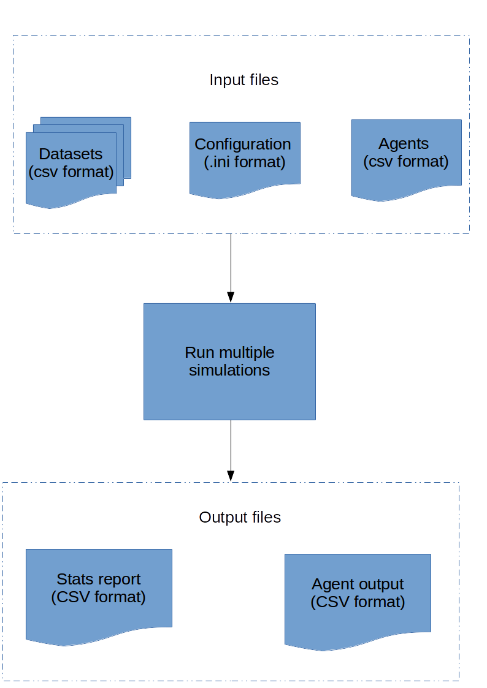

=======================================================
FastSTI: Simulations of sexually transmitted infections
=======================================================

############
Introduction
############

FastSTI is a framework for agent-based models of large simulations of sexually
transmitted infection epidemics. It is designed to handle up to tens of millions of
agents on standard consumer hardware, like your laptop or, or a high performance
computer.

It runs simulations in parallel. The output of the simulations is written to CSV
files, which can be further processed in scripting languages like Python
or R.

You can do sophisticated simulations without making any modifications to the
code. But if you do wish to extend the framework, it is written in C. The
framework has been designed with extensibility in mind. The code adheres
strictly to the C11 standard and should compile on any good modern C compiler.

############
Installation
############

*********
GNU/Linux
*********

Carry out these steps to install FastSTI on a GNU/Linux PC that uses apt
(e.g. Ubuntu).

Install the dependencies: ::

  sudo apt install git build-essential meson valgrind libgsl-dev libglib2.0-dev

Installing the framework is quick and easy.

Create a folder for the installation and cd into it. E.g. ::

  mkdir mysim; cd mysim
  git clone https://github.com/nathangeffen/faststi .

Installations are cheap and easy. Install as often as you like and, if an
installation is no longer needed, simply remove its folder with "rm -f".

***********
Apple macOS
***********

Compiling on macOS is easy. You can use either Apples clang/LLVM compiler or the
GNU C compiler.

Install and configure the dependencies with `Homebrew <https://brew.sh/>`_: ::

* (If you don't have Homebrew installed): ::

    /usr/bin/ruby -e "$(curl -fsSL  https://raw.githubusercontent.com/Homebrew/install/master/install)"
    brew install gcc pkg-config glib gsl meson ninja

- Create a folder for the installation and cd into it. E.g. ::

    mkdir mysim; cd mysim
    git clone https://github.com/nathangeffen/faststi .

Installations are cheap and easy. Install as often as you like and, if an
installation is no longer needed, simply remove its folder with "rm -f".

*******
Windows
*******

We haven't developed or tested FastSTI on Windows, but it should work,
especially if you use the MinGW suite. Feedback (via the `Github repository <https://github.com/faststi>`_) on
running it under Windows is welcome.

#####################
Testing that it works
#####################

If you use gcc as your C compiler, then simply do this: ::

  meson debug
  cd debug; ninja
  FSTI_DATA=../data ./src/faststi -t

This will run the test suite. If everything is properly installed no failures
should be reported.

You've created an unoptimised version of the faststi executable, useful for
debugging and development. To create an optimised version for running big,
CPU-intensive simulations, do this from the root directory of your simulation
(*mysim* in the above example): ::

  meson --buildtype release release

To test that it's working: ::

  cd release
  FSTI_DATA=../data ./src/faststi -t

Alternately you can use the *fsti* script in your installation directory. Assuming
you called it *mysim*, change into the *mysim* directory, and run: ::

  ./fsti -t

The above will create the debug directory, compile FastSTI, and run the test
suite. To instead run the release version: ::

  ./fsti release -t

Again, no errors should be reported.

If you have `valgrind <https://valgrind.org>`_ on your system (an excellent tool
for finding memory and other problems in C programs), you can do this: ::

  cd debug
  ninja test

##################
How to use FastSTI
##################

FastSTI takes as input a configuration file which tells it how many simulations
to run, and how to run each simulation. It also takes data as input in files
that we call datasets. And optionally, it takes a file of agents, though the
agents can be generated by FastSTI itself, via instructions in the configuration file.

The outputs are a report of simulation results, and the agents.

    FastSTI inputs include a configuration file, datasets and agent files. The
    outputs are an agent file and simulation results.

***********
Simulations
***********

A simulation continuously iterates over sets of agents, executing events on the
agents on each iteration (which we call a time step). The structure of a FastSTI
simulation is: ::

  Execute events before simulation runs
  for each time-step
    for each event E
        for each agent A
            if E should be applied to A
                apply E to A
  Execute events after simulation runs

The number of agents and the specific events to execute are specified in a
configuration file. FastSTI's configuration file uses the *.ini* format, which
are the standard simple configuration format used on MS Windows and the GTK
framework popular on Linux systems.

You can configure the number of agents, the events and the order of events that
execute upon them, the size of the time step (default 1 day), the number of time
steps (default 10 years) and much else (see :ref:`parameter-ref`).

FastSTI has a number of useful built-in events useful for modelling STI
epidemics (see :ref:`event-ref`). These include agent ageing, death, matching
agents in sexual relationships, infection with the STI, disease advance,
co-infection, and breakups.

There are also useful supporting events that read in agent files or generate the
agents, write the agents to a CSV file, and write basic statistics to a CSV file.

If you need more events, the framework has been designed with extensibility in
mind. You can define new events in C, identify them to FastSTI, quickly
recompile the code and use them.

*******
Example
*******

Let's start off with the simplest simulation. Change into the
simulations/examples directory. Take a look at eg1.ini. ::

  # Faststi "Hello world" equivalent simulation
  [Simulation_0]
  after_events=_report

The first line is a comment.

The second line is the name of the simulation group: *First simulation*. A
simulation group can have one or more simulations. This particular group has
only one simulation.

The third line is one of the dozens of parameters used to configure
simulations. The *after_events* parameter tells FastSTI what events to execute
when the simulation is finished. *_report* is a built-in event that prints out
basic information about the state of a simulation. All built-in events are
prefixed with an underscore, to differentiate them from ones you might code
yourself.

To run the simulation: ::

  ../../fsti -f eg1.ini

The output may look something like this: ::

  First simulation;0;0;2028-01-01;MIN_AGE_ALIVE;nan
  First simulation;0;0;2028-01-01;MAX_AGE_ALIVE;nan
  First simulation;0;0;2028-01-01;MEAN_AGE_ALIVE;nan
  First simulation;0;0;2028-01-01;MEDIAN_AGE_ALIVE;nan
  First simulation;0;0;2028-01-01;INFECT_RATE_ALIVE;-nan
  First simulation;0;0;2028-01-01;POP_ALIVE;0
  First simulation;0;0;2028-01-01;NUM_PARTNERS;0
  First simulation;0;0;2028-01-01;MIN_AGE_DEAD;nan
  First simulation;0;0;2028-01-01;MAX_AGE_DEAD;nan
  First simulation;0;0;2028-01-01;MEAN_AGE_DEAD;nan
  First simulation;0;0;2028-01-01;INFECT_RATE_DEAD;-nan
  First simulation;0;0;2028-01-01;POP_DEAD;0
  First simulation;0;0;2028-01-01;INITIAL_INFECTIONS;0
  First simulation;0;0;2028-01-01;SIMULATION_INFECTIONS;0
  First simulation;0;0;2028-01-01;INITIAL_MATCHES;0
  First simulation;0;0;2028-01-01;SIMULATION_MATCHES;0
  First simulation;0;0;2028-01-01;BREAKUPS;0
  First simulation;0;0;2028-01-01;TIME_TAKEN;0

Note that it's in csv format, so you easily import it into Python or R and
process it. You can also redirect the output to a file instead of standard
output with the *results_file* parameter.

The fields of the csv file are: the name of the simulation, the number of the
current simulation, the number of the simulation within the current simulation
group, the date within the simulation for which the output applies, a
description field, and the value of the description field. E.g. the last two
columns of the last line are TIME_TAKEN and 0. This tells you that it took zero
seconds for the simulation to run. Likewise the POP_ALIVE and POP_DEAD entries
tell us that the population alive and dead in this simulation on 1 January 2028
is 0.

A full simulation
~~~~~~~~~~~~~~~~~

The output of the eg1.ini simulation is rather uninteresting. To get more
interesting output we need a more interesting simulation. Take a look at
eg2.ini.

.. code-block:: ini
   :linenos:

      # First interesting simulation

      [Full simulation]

      num_simulations=4
      num_agents=10000
      time_step=1 DAY
      simulation_period=10 YEARS

      before_events=_write_agents_csv_header;_generate_and_pair;_report;_write_agents_csv
      during_events=_age;_breakup_and_pair;_infect;_stage;_birth;_death
      after_events=_write_agents_csv;_report

      dataset_gen_sex=dataset_gen_sex.csv
      dataset_gen_sex_preferred=dataset_gen_sex_preferred.csv
      dataset_gen_infect=dataset_gen_infect.csv
      dataset_gen_treated=dataset_gen_treated.csv
      dataset_gen_resistant=dataset_gen_resistant.csv
      dataset_gen_mating=dataset_gen_mating.csv

      dataset_birth_infect=dataset_gen_infect.csv
      dataset_birth_treated=dataset_birth_treated.csv
      dataset_birth_resistant=dataset_birth_resistant.csv

      dataset_rel_period=dataset_rel.csv
      dataset_single_period=dataset_single.csv
      dataset_infect=dataset_infect.csv
      dataset_infect_stage=dataset_infect_stage.csv
      dataset_mortality=dataset_mortality_simple.csv

      agents_output_file=agents_out.csv
      results_file=results.csv

      threads=1

      [Change time period]

      threads=0 # As many threads as there are cores will execute
      simulation_period=5 YEARS

Assuming you are in the simulations/examples directory you can run this
simulation as follows: ::

  ../../fsti release -f eg2.ini

The *release* command line parameter ensures the much faster *release* version
of FastSTI (without debugging code) executes. It will likely take about 10
seconds to run.

This is what the configuration does:

- Line 1 is a comment. Comments start with a #.
- Line 3 specifies the name of the first group of simulations: *Full simulation*
- Line 5 specifies the number of simulations to run in this group. Note that
  parameter names, like *num_simulations*, are case-sensitive.
- Line 6 specifies the number of agents in the simulation.
- Line 7 specifies the time period represented by each simulation iteration, 1
  day in this case. The format for this parameter and others like it that
  specify a time period is a positive integer followed by either MINUTE, HOUR,
  DAY, WEEK, MONTH or YEAR. You can also use the plural of any of these time
  periods or any combination of lower and upper case (i.e. minute, minutes,
  hour, hours, day, days, week, weeks, month, months or year, years). You can
  also put a hyphen instead of a space between the integer and the time
  period. If you leave out the time period, it's assumed to be minutes. In
  FastSTI, the predefined time period have the following number of minutes:

  - hour: 60
  - day: 1,440
  - week: 10,080
  - month: 43,830
  - year: 525,949

- Line 8 specifies the simulation period: 10 years in this case. The number of
  time steps (or iterations) of the simulation is calculated by dividing the
  simulation_period by the time_step. In this simulation there are therefore
  3,652 iterations: :math:`10 \times 525949 / 1440`.
- Line 10 lists the events that are to be run before each simulation
  starts.

  - The _write_agents_csv_header event simply writes the first line of the csv
    file to which agents will be written.
  - The _generate_and_pair event generates agents (equal to the *num_agents*
    parameter) and pairs a subset of them in sexual relationships.
  - The _report event prints out some simple statistics about the agent
    population.
  - The _write_agents_csv event prints out the agents in csv format.

- Line 11 lists the events that are run on every iteration of the simulation.

  - The _age event increases the age of each agent by the *time_step* of the
    simulation (one day in this example).
  - The _breakup_and_pair event pairs a subset of agents into sexual
    partnerships and breaks up another subset of agents who are already in
    sexual partnerships.
  - The _infect event infects a subset of agents in sexual partnerships with
    other infected agents with the pathogen being studied, e.g. HIV.
  - The _stage event manages the infection progression of infected agents. For
    example, agents with HIV will first be in an acute sero-conversion phase,
    than a chronic infection stage, and then one or more stages that are
    analogous to progression to AIDS.
  - The _birth and _death events create new agents and kill agents respectively.

  Many of these events depend on pre-specified parameters to calculate
  probabilities of the events occurring and, perhaps, other outcomes. These data
  are described in dataset files which are described in the
  :ref:`dataset-format` section.

- Lines 14 to 29 list the names of the datasets associated with the various
  events. For example the *dataset_mortality* parameter tells the simulation the
  probability of an agent with a given set of characteristics dying.
- Line 32 tells the simulation to write agents out to a csv file called
  *agents_out.csv*.
- Line 33 tells the simulation to write simple population level statistical
  information produced by the *_report* event to a file called *results.csv*.
- Line 35 tells the simulation to run as a single thread. In other words each of
  the four simulations (specified on line 5) will run consecutively.
- Line 37 specifies a new simulation group called *Change time period*.
- Line 39 tells FastSTI to run the simulations in parallel, using up to as many
  threads as there are CPU cores in the machine. On a quad-core CPU, all four
  simulations could run at the same time.
- Line 40 specifies a different simulation period (5 years) to the *Full simulation* set
  of simulations. All other parameters set in the *Full simulation* set carry
  through to this simulation set.

There are more configuration examples in the simulation directory.

##################
Input file formats
##################

*************
Configuration
*************

The configuration file, which specifies the simulations, is in Windows ini
format. Here is an example:

.. code-block:: ini
   :linenos:

      # Faststi test configuration file

      [Simulation 0]

      num_simulations=1
      num_agents=10000
      simulation_period=10 YEARS

      agents_output_file=agents_out.csv
      results_file=results.csv

      dataset_gen_sex=dataset_gen_sex.csv
      dataset_gen_sex_preferred=dataset_gen_sex_preferred.csv
      dataset_gen_infect=dataset_gen_infect.csv
      dataset_gen_treated=dataset_gen_treated.csv
      dataset_gen_resistant=dataset_gen_resistant.csv
      dataset_gen_mating=dataset_gen_mating.csv

      dataset_birth_infect=dataset_gen_infect.csv
      dataset_birth_treated=dataset_birth_treated.csv
      dataset_birth_resistant=dataset_birth_resistant.csv

      dataset_rel_period=dataset_rel.csv
      dataset_single_period=dataset_single.csv
      dataset_infect=dataset_infect.csv
      dataset_infect_stage=dataset_infect_stage.csv
      dataset_mortality=dataset_mortality_simple.csv

      before_events=_write_agents_csv_header;_generate_and_pair;_report;_write_agents_csv
      during_events=_age;_breakup_and_pair;_infect;_stage;_birth;_death
      after_events=_write_agents_csv;_report

      match_k=100
      threads=1

      [Simulation 1]

      dataset_mortality=dataset_mortality_complicated.csv
      match_k=300

- Comment lines begin with a #.
- A # in the middle of a line also denotes a comment until the end of the line.
- A simulation group name is enclosed in square brackets *[]*.
- Within a simulation group, parameters are specified as key-vale pairs. A key is
  separated from its value by an equals sign. White space before and after the =
  sign is ignored.
- Some parameters (e.g. *during_events* take multiple values. Each value must be
  separated by a semi-colon *;*. White space before or after the semi-colon is
  ignored.
- Blank lines are ignored.
- Each key must be a predefined parameter. If you use a key that isn't a
  predefined parameter, the FastSTI will give an error message and terminate. To
  see all the parameters, run: ::

    ./fsti -p

- Key-values set in a simulation group are carried through to subsequent groups,
  unless they are specified again in the new group. E,g, in the example above,
  *dataset_mortality* and *match_k* are specified again for the simulation group
  called *Simulation 1*. All the other parameters are identical to *Simulation
  0*.

Besides setting parameters in the input configuration file, you can modify them
on the command line using this format: ::

  ./fsti -c=<value>[;<value>]* -f <filename>

.. _dataset-format:

********
Datasets
********

Many events depend on datasets. The format of the dataset file is a little
cumbersome but it is designed for a combination of speed and safety.

Datasets can either be placed in the *data* directory, or in the directory in
which the simulation is being run. Alternately, the *FSTI_DATA* environment
variable can be set to the location where the datasets are located.

Datasets are csv files. The default delimiter is a semi-colon, not a comma. You
can change this by setting the csv_delimiter

A standard dataset consists of 0 or more columns representing the values of
agent properties, followed by 1 or more columns representing probabilities or
other derived values. Events typically match the properties of the current agent
being operated upon to the corresponding row in the dataset in order to obtain
the appropriate probability of the event occurring. Sometimes there

Let's start with the very simplest of the supplied datasets. It is
*dataset_gen_sex.csv* and it is located in the *data* directory. It is used by
the *_generate_agents* event to initialize the sex of agents at the beginning of
simulations.  Here it is:

.. code-block:: ini
   :linenos:

      Probability
      0.5

Line 1 is simply the CSV header. It is called *Probability* here but we could
have named it anything. Line 2 is 0.5, the odds of being male. The event
uses this to set approximately half the agents to male and half to female when
it generates agents.

Here's a more typical dataset, *dataset_gen_infect.csv*, also used by the
*_generate_agents* event to determine the infection stage, if any, of agents
when they are initialized.

.. code-block:: none
   :linenos:

      sex;sex_preferred;age|10-YEAR;1;2;3;4|4
      0;0;0;0;0;0;0
      0;0;1;0;0;0;0
      0;0;2;0.1;0.2;0.3;0.4
      0;0;3;0.1;0.2;0.3;0.4
      0;0;4;0.05;0.1;0.15;0.2
      0;0;5;0.025;0.05;0.075;0.1
      0;1;0;0;0;0;0
      0;1;1;0;0;0;0
      0;1;2;0.05;0.1;0.15;0.2
      0;1;3;0.05;0.1;0.15;0.2
      0;1;4;0.025;0.05;0.075;0.1
      0;1;5;0.0125;0.025;0.0375;0.05
      1;0;0;0;0;0;0
      1;0;1;0;0;0;0
      1;0;2;0.05;0.1;0.15;0.2
      1;0;3;0.05;0.1;0.15;0.2
      1;0;4;0.025;0.05;0.075;0.1
      1;0;5;0.0125;0.025;0.0375;0.05
      1;1;0;0;0;0;0
      1;1;1;0;0;0;0
      1;1;2;0.05;0.1;0.15;0.2
      1;1;3;0.05;0.1;0.15;0.2
      1;1;4;0.025;0.05;0.075;0.1
      1;1;5;0.0125;0.025;0.0375;0.05

In the example HIV model provided, there are five possible values for
*infection*:

- 0 = uninfected
- 1 = virally suppressed (usually on treatment)
- 2 = primary infection (highly infectious)
- 3 = chronic infection (usually lasts several years)
- 4 = Final stage (AIDS)

Let's start with the header (line 1). The last column is *4|4*. The first "4" is
simply the name of the column (representing stage 4 infection), and could have
been called anything. But the "4" after the pipe (|) tells FastSTI that the last
four columns all represent probabilities. If a dataset contains more than one
probability column then this must be specified. FastSTI then knows that the
first three fields, *sex*, *sex_preferred* and *age* are not probability
columns, and correspond precisely to the names of fields in the fsti_agent data
structure. If they didn't, FastSTI would terminate with an error.

The dataset needs an entry (or row) for each combination of sex, sex_preferred
and age. Also the first row of every dataset after the header must start with
every property set to 0, and then cycle incrementally through all combinations
of possible values for the properties. This may sound tiresome, but it ensures
that probabilities can be looked up using a random access search, rather than
having to sequentially search the table.

There is one important short-cut. Notice the column headed "age|10-YEAR". The
pipe followed by either an integer or a time period, tells FastSTI to divide the
agent's age by this number, in this case 10 years, in order to get the value to
search for in the dataset. So an agent with age 45 will have its age divided by
10 which gives it a lookup value for its age of 4 (the .5 is dropped - this is
integer division).

What about an agent whose age is 60 or more (because the ages run from 0 to 5)? The
dataset lookup algorithm assumes any agent property greater than the largest
value is equal to the largest value.

Consider an agent who is male, prefers to have sex with females and is 31 years
old. What is the probability they are HIV-positive (in this dataset)? And if
HIV-positive, what infection stage is he likely to be in?

The agent matches line 11, which corresponds to male agents (first column with a
value of 0) whose preferred sexual partner is female (second column with a value
of 1) and agents aged 30 to 39 (third column with a value of 3, i.e. 31 / 3).

To determine if the agent is infected with HIV, the *_generate_agents* event
samples a uniform random number, *r*.

- If *r* is less than 0.05 (the value in column 4 of line 11), the agent is in stage 1.
- If *r* is less than 0.1 (the value in column 5 of line 11), the agent is in stage 2.
- If *r* is less than 0.15 (the value in column 6 of line 11) the agent is in
  stage 3.
- If *r* is less than 0.2 (the value in column 7 of line 11) the agent is in
  stage 4.
- Else if *r* is greater than or equal to 0.2, the agent is uninfected.

With most events, the agent characteristics you use are up to you. You could
create a dataset for generating the initial infection status of agents that
doesn't take into account *sex_preferred* or *age*. Alternately, you could add a
*coinfection* column (because there is a field called coinfection in the FastSTI
agent structure), and make the infection probabilities dependent on that.

There is somewhat less flexibility with the probability fields. These are
event-specific. As it happens the code that sets the infection stage expects one
or more user-defined stages, so you can specify fewer or more than the four
stages in the above example.

Two-agent datasets
~~~~~~~~~~~~~~~~~~

Some events need to make a decision based on two agents. In modelling sexually
transmitted infections, the most obvious example is an event that determines if
an agent becomes infected. FastSTI's supplied *_infect* event does just this. It
iterates over all pairs of agents in sero-discordant sexual relationships, and
determines whether the negative partners becomes infected.

Consider two agents, *a* and *b*. One, *a*, is uninfected, and the other *b* is
infected. If we want the risk of infection to be determined by *a*'s sex and
whether it is in a same-sex or opposite-sex relationship with *b* then we need
some way of specifying this in a dataset. Also, we are interested in what
infection stage *b* is in. If *b* is on treatment, for example, the risk of
infecting *a* may be very low.

The dataset_infect.csv dataset shows how this is handled in FastSTI.

.. code-block:: none
   :linenos:

      sex;sex|1|~;infected;probability
      0;0;0;0
      0;0;1;0
      0;0;2;0.02
      0;0;3;0.008
      0;0;4;0.008
      0;1;0;0
      0;1;1;0
      0;1;2;0.01
      0;1;3;0.004
      0;1;4;0.004
      1;0;0;0
      1;0;1;0
      1;0;2;0.012
      1;0;3;0.005
      1;0;4;0.005
      1;1;0;0
      1;1;1;0
      1;1;2;0.0001
      1;1;3;0.0001
      1;1;4;0.0001

The header (line 1) contains two columns named *sex*. The first one corresponds
to the uninfected agent, *a*. The second and third columns are the sex and
infection stage of *b*. How does FastSTI know this? Look at the second column
heading: *sex|1|~*.  The first pipe (|) is used to separate sex from the amount the
property must be divided by. Well, unlike age, we don't want the sex to be more
granular, so we specify it as 1. The second pipe is followed by a tilde
(~). The tilde in the column header tells FastSTI that this is a two-agent
lookup table and the second agent's properties start in this column. So the
second and third columns belong to agent *b*. The final column, with name
*probability*, is simply the probability of becoming infected. (By default events
are executed daily, so the probability must correspond to this time-step.)

So if agent *a* is a female, and agent *b* is male in stage 2 (primary
infection), what is the risk of *a* becoming infected on this iteration of the
*_infect* event? The answer is given by line 14: 0.012.

******
Agents
******

Instead of generating agents, you can provide an agent file as input to the
simulation. In fact, since the agent generation features of FastSTI are
currently quite limited, you'll probably prefer to supply an agent file.

The agents must be specified in a CSV file. The column names in the header row
must correspond to one or more field names in FastSTI's agent structure, which is declared
as *struct fsti_agent* in the source file *src/fsti-agent.h*. The fields are:

- id: unsigned 32 bit integer, unique for each agent (If you do not include this
  field, FastSTI automatically provides this value for each agent, starting from
  0.)
- sex: unsigned 8 bit integer (0 is male, 1 is female. Higher values are user-defined.)
- Either sex_preferred or orientation, an unsigned 8 bit integer (Do not use
  both fields. We recommend using sex_preferred rather than orientation. For
  sex_preferred 0 is male, 1 is female. For orientation either use 0 and 1 for
  heterosexual and homosexual respectively, or 0, 1, 2 and 3 for MSM, MSW, WSM
  and WSW respectively. Higher values are user-defined.)
- age: a positive year age of an agent between 0 and 120.
- birthday: a signed 32 bit integer (Unless you understand the internal workings
  of FastSTI very well, we recommend you rather use age)
- infected: unsigned 8 bit integer (0 is uninfected. 1 and up can correspond to
  stages of infection.)
- treated: unsigned 8 bit integer (0 is untreated. 1 and up can correspond to
  treatment regimens.)
- resistant: unsigned 8 bit integer (0 is no resistance. You can either use a
  simple approach to resistance, whereby 1 means resistant to treatment regimen
  1, 2 to treatment regimen 2 etc, or you can use a more complex binary bitmask
  approach where 1 denotes resistance to regimen 1 only, 10, denotes resistance
  to regimen 2, 11 denotes resistance to regimen 1 and 2 etc.)
- coinfected (0 means not coinfected. 1 and up denotes different types of
  coinfection as chosen by the user. Once again, as with the resistant field,
  either a simple or bitmask approach can be used.)
- partners_0, partners_1, and partners_2: unsigned 32 bit integers denoting the
  id of a sexual partner of this agent (-1 implies agent is single. The agents
  are typically numbered from 0. Note: None of the default FastSTI events
  currently caters for concurrency. Only use partners_1 and partners_2 if you
  are implementing events that rely on partner concurrency. If you need more
  partners, change the value of FSTI_MAX_PARTNERS in fsti_userdefs.h.)
- relchange_0, relchange_1, and relchange_2: unsigned 32 bit integers
  corresponding to the iteration (i.e. time step) in the simulation when the
  agent's relationship status for partner_0, partner_1 and partner_2
  respectively should change, either to single for agents with partners or to be
  placed in the mating pool if the agent is single

Here is an example CSV file. The default delimiter is a semi-colon, not a comma. You
can change this by setting the csv_delimiter.

.. code-block:: none
   :linenos:

      id;age;infected;sex;sex_preferred;partners_0
      0;45.21;0;1;0;-1
      1;47.35;1;0;1;0
      2;36.62;0;1;0;-1
      3;35.40;0;1;0;-1
      4;24.25;0;0;1;-1
      5;24.12;0;0;1;4
      6;23.26;0;0;1;-1
      7;45.17;0;0;1;-1
      8;34.81;0;0;1;-1
      9;35.80;0;0;1;8

###################
Output file formats
###################

***************
Results reports
***************

Whenever the *_report* is executed, it writes output in CSV format either to the
standard output device (default) or an output file as specified by the
*results_file* key in the configuration. This output is meant to be
post-processed by you either in a spreadsheet, or using a scripting language
like R or Python.

.. note:: The *_report* event prints out quite basic information. If you feel
          comfortable writing C code, you can enhance it in the fsti_userdefs.h
          file by defining the *FSTI_HOOK_REPORT* macro. See the *FSTI_REPORT*
          macro in fsti-defaults.h.

Here is an example output from a set of simulations:

.. code-block:: none
   :linenos:

      name;sim;num;date;description;value
      Simulation_0;0;0;2018-01-01;MIN_AGE_ALIVE;15.000000
      Simulation_0;0;0;2018-01-01;MAX_AGE_ALIVE;49.000000
      Simulation_0;0;0;2018-01-01;MEAN_AGE_ALIVE;23.000000
      Simulation_0;0;0;2018-01-01;MEDIAN_AGE_ALIVE;18.000000
      Simulation_0;0;0;2018-01-01;INFECT_RATE_ALIVE;0.077900
      Simulation_0;0;0;2018-01-01;POP_ALIVE;20000
      Simulation_0;0;0;2018-01-01;NUM_PARTNERS;3573
      Simulation_0;0;0;2018-01-01;MIN_AGE_DEAD;nan
      Simulation_0;0;0;2018-01-01;MAX_AGE_DEAD;nan
      Simulation_0;0;0;2018-01-01;MEAN_AGE_DEAD;nan
      Simulation_0;0;0;2018-01-01;INFECT_RATE_DEAD;-nan
      Simulation_0;0;0;2018-01-01;POP_DEAD;0
      Simulation_0;0;0;2018-01-01;INITIAL_INFECTIONS;1558
      Simulation_0;0;0;2018-01-01;SIMULATION_INFECTIONS;0
      Simulation_0;0;0;2018-01-01;INITIAL_MATCHES;3573
      Simulation_0;0;0;2018-01-01;SIMULATION_MATCHES;0
      Simulation_0;0;0;2018-01-01;BREAKUPS;0
      Simulation_0;0;0;2018-01-01;TIME_TAKEN;1
      Simulation_0;0;0;2028-01-01;MIN_AGE_ALIVE;15.000000
      Simulation_0;0;0;2028-01-01;MAX_AGE_ALIVE;59.000000
      Simulation_0;0;0;2028-01-01;MEAN_AGE_ALIVE;30.000000
      Simulation_0;0;0;2028-01-01;MEDIAN_AGE_ALIVE;26.000000
      Simulation_0;0;0;2028-01-01;INFECT_RATE_ALIVE;0.142421
      Simulation_0;0;0;2028-01-01;POP_ALIVE;23592
      Simulation_0;0;0;2028-01-01;NUM_PARTNERS;8442
      Simulation_0;0;0;2028-01-01;MIN_AGE_DEAD;15.000000
      Simulation_0;0;0;2028-01-01;MAX_AGE_DEAD;58.000000
      Simulation_0;0;0;2028-01-01;MEAN_AGE_DEAD;31.000000
      Simulation_0;0;0;2028-01-01;INFECT_RATE_DEAD;0.738192
      Simulation_0;0;0;2028-01-01;POP_DEAD;741
      Simulation_0;0;0;2028-01-01;INITIAL_INFECTIONS;1558
      Simulation_0;0;0;2028-01-01;SIMULATION_INFECTIONS;2349
      Simulation_0;0;0;2028-01-01;INITIAL_MATCHES;3573
      Simulation_0;0;0;2028-01-01;SIMULATION_MATCHES;145574
      Simulation_0;0;0;2028-01-01;BREAKUPS;140193
      Simulation_0;0;0;2028-01-01;TIME_TAKEN;6
      Simulation_0;1;1;2018-01-01;MIN_AGE_ALIVE;15.000000
      Simulation_0;1;1;2018-01-01;MAX_AGE_ALIVE;49.000000
      Simulation_0;1;1;2018-01-01;MEAN_AGE_ALIVE;23.000000
      Simulation_0;1;1;2018-01-01;MEDIAN_AGE_ALIVE;18.000000
      Simulation_0;1;1;2018-01-01;INFECT_RATE_ALIVE;0.080300
      Simulation_0;1;1;2018-01-01;POP_ALIVE;20000
      Simulation_0;1;1;2018-01-01;NUM_PARTNERS;3601
      Simulation_0;1;1;2018-01-01;MIN_AGE_DEAD;nan
      Simulation_0;1;1;2018-01-01;MAX_AGE_DEAD;nan
      Simulation_0;1;1;2018-01-01;MEAN_AGE_DEAD;nan
      Simulation_0;1;1;2018-01-01;INFECT_RATE_DEAD;-nan
      Simulation_0;1;1;2018-01-01;POP_DEAD;0
      Simulation_0;1;1;2018-01-01;INITIAL_INFECTIONS;1606
      Simulation_0;1;1;2018-01-01;SIMULATION_INFECTIONS;0
      Simulation_0;1;1;2018-01-01;INITIAL_MATCHES;3601
      Simulation_0;1;1;2018-01-01;SIMULATION_MATCHES;0
      Simulation_0;1;1;2018-01-01;BREAKUPS;0
      Simulation_0;1;1;2018-01-01;TIME_TAKEN;6
      Simulation_0;1;1;2028-01-01;MIN_AGE_ALIVE;15.000000
      Simulation_0;1;1;2028-01-01;MAX_AGE_ALIVE;59.000000
      Simulation_0;1;1;2028-01-01;MEAN_AGE_ALIVE;30.000000
      Simulation_0;1;1;2028-01-01;MEDIAN_AGE_ALIVE;26.000000
      Simulation_0;1;1;2028-01-01;INFECT_RATE_ALIVE;0.142754
      Simulation_0;1;1;2028-01-01;POP_ALIVE;23516
      Simulation_0;1;1;2028-01-01;NUM_PARTNERS;8432
      Simulation_0;1;1;2028-01-01;MIN_AGE_DEAD;15.000000
      Simulation_0;1;1;2028-01-01;MAX_AGE_DEAD;55.000000
      Simulation_0;1;1;2028-01-01;MEAN_AGE_DEAD;31.000000
      Simulation_0;1;1;2028-01-01;INFECT_RATE_DEAD;0.768553
      Simulation_0;1;1;2028-01-01;POP_DEAD;795
      Simulation_0;1;1;2028-01-01;INITIAL_INFECTIONS;1606
      Simulation_0;1;1;2028-01-01;SIMULATION_INFECTIONS;2362
      Simulation_0;1;1;2028-01-01;INITIAL_MATCHES;3601
      Simulation_0;1;1;2028-01-01;SIMULATION_MATCHES;146416
      Simulation_0;1;1;2028-01-01;BREAKUPS;141010
      Simulation_0;1;1;2028-01-01;TIME_TAKEN;11
      Simulation_1;2;0;2018-01-01;MIN_AGE_ALIVE;15.000000
      Simulation_1;2;0;2018-01-01;MAX_AGE_ALIVE;49.000000
      Simulation_1;2;0;2018-01-01;MEAN_AGE_ALIVE;23.000000
      Simulation_1;2;0;2018-01-01;MEDIAN_AGE_ALIVE;18.000000
      Simulation_1;2;0;2018-01-01;INFECT_RATE_ALIVE;0.080600
      Simulation_1;2;0;2018-01-01;POP_ALIVE;20000
      Simulation_1;2;0;2018-01-01;NUM_PARTNERS;3569
      Simulation_1;2;0;2018-01-01;MIN_AGE_DEAD;nan
      Simulation_1;2;0;2018-01-01;MAX_AGE_DEAD;nan
      Simulation_1;2;0;2018-01-01;MEAN_AGE_DEAD;nan
      Simulation_1;2;0;2018-01-01;INFECT_RATE_DEAD;-nan
      Simulation_1;2;0;2018-01-01;POP_DEAD;0
      Simulation_1;2;0;2018-01-01;INITIAL_INFECTIONS;1612
      Simulation_1;2;0;2018-01-01;SIMULATION_INFECTIONS;0
      Simulation_1;2;0;2018-01-01;INITIAL_MATCHES;3569
      Simulation_1;2;0;2018-01-01;SIMULATION_MATCHES;0
      Simulation_1;2;0;2018-01-01;BREAKUPS;0
      Simulation_1;2;0;2018-01-01;TIME_TAKEN;5
      Simulation_1;2;0;2028-01-01;MIN_AGE_ALIVE;15.000000
      Simulation_1;2;0;2028-01-01;MAX_AGE_ALIVE;59.000000
      Simulation_1;2;0;2028-01-01;MEAN_AGE_ALIVE;30.000000
      Simulation_1;2;0;2028-01-01;MEDIAN_AGE_ALIVE;26.000000
      Simulation_1;2;0;2028-01-01;INFECT_RATE_ALIVE;0.136983
      Simulation_1;2;0;2028-01-01;POP_ALIVE;23638
      Simulation_1;2;0;2028-01-01;NUM_PARTNERS;8423
      Simulation_1;2;0;2028-01-01;MIN_AGE_DEAD;15.000000
      Simulation_1;2;0;2028-01-01;MAX_AGE_DEAD;59.000000
      Simulation_1;2;0;2028-01-01;MEAN_AGE_DEAD;32.000000
      Simulation_1;2;0;2028-01-01;INFECT_RATE_DEAD;0.717507
      Simulation_1;2;0;2028-01-01;POP_DEAD;754
      Simulation_1;2;0;2028-01-01;INITIAL_INFECTIONS;1612
      Simulation_1;2;0;2028-01-01;SIMULATION_INFECTIONS;2167
      Simulation_1;2;0;2028-01-01;INITIAL_MATCHES;3569
      Simulation_1;2;0;2028-01-01;SIMULATION_MATCHES;145976
      Simulation_1;2;0;2028-01-01;BREAKUPS;140568
      Simulation_1;2;0;2028-01-01;TIME_TAKEN;10
      Simulation_1;3;1;2018-01-01;MIN_AGE_ALIVE;15.000000
      Simulation_1;3;1;2018-01-01;MAX_AGE_ALIVE;49.000000
      Simulation_1;3;1;2018-01-01;MEAN_AGE_ALIVE;23.000000
      Simulation_1;3;1;2018-01-01;MEDIAN_AGE_ALIVE;18.000000
      Simulation_1;3;1;2018-01-01;INFECT_RATE_ALIVE;0.083850
      Simulation_1;3;1;2018-01-01;POP_ALIVE;20000
      Simulation_1;3;1;2018-01-01;NUM_PARTNERS;3550
      Simulation_1;3;1;2018-01-01;MIN_AGE_DEAD;nan
      Simulation_1;3;1;2018-01-01;MAX_AGE_DEAD;nan
      Simulation_1;3;1;2018-01-01;MEAN_AGE_DEAD;nan
      Simulation_1;3;1;2018-01-01;INFECT_RATE_DEAD;-nan
      Simulation_1;3;1;2018-01-01;POP_DEAD;0
      Simulation_1;3;1;2018-01-01;INITIAL_INFECTIONS;1677
      Simulation_1;3;1;2018-01-01;SIMULATION_INFECTIONS;0
      Simulation_1;3;1;2018-01-01;INITIAL_MATCHES;3550
      Simulation_1;3;1;2018-01-01;SIMULATION_MATCHES;0
      Simulation_1;3;1;2018-01-01;BREAKUPS;0
      Simulation_1;3;1;2018-01-01;TIME_TAKEN;5
      Simulation_1;3;1;2028-01-01;MIN_AGE_ALIVE;15.000000
      Simulation_1;3;1;2028-01-01;MAX_AGE_ALIVE;59.000000
      Simulation_1;3;1;2028-01-01;MEAN_AGE_ALIVE;30.000000
      Simulation_1;3;1;2028-01-01;MEDIAN_AGE_ALIVE;26.000000
      Simulation_1;3;1;2028-01-01;INFECT_RATE_ALIVE;0.139352
      Simulation_1;3;1;2028-01-01;POP_ALIVE;23595
      Simulation_1;3;1;2028-01-01;NUM_PARTNERS;8456
      Simulation_1;3;1;2028-01-01;MIN_AGE_DEAD;15.000000
      Simulation_1;3;1;2028-01-01;MAX_AGE_DEAD;58.000000
      Simulation_1;3;1;2028-01-01;MEAN_AGE_DEAD;31.000000
      Simulation_1;3;1;2028-01-01;INFECT_RATE_DEAD;0.728205
      Simulation_1;3;1;2028-01-01;POP_DEAD;780
      Simulation_1;3;1;2028-01-01;INITIAL_INFECTIONS;1677
      Simulation_1;3;1;2028-01-01;SIMULATION_INFECTIONS;2179
      Simulation_1;3;1;2028-01-01;INITIAL_MATCHES;3550
      Simulation_1;3;1;2028-01-01;SIMULATION_MATCHES;146061
      Simulation_1;3;1;2028-01-01;BREAKUPS;140609
      Simulation_1;3;1;2028-01-01;TIME_TAKEN;10

- The first column (name) is the simulation group name as specified in the configuration
  file.
- The second column (sim) is the unique simulation number. In every execution of
  FastSTI, each simulation will have its own unique id, starting from 0.
- The third column (num) is the number of the simulation within the simulation
  group. Here each of the two simulation groups (Simulation_0 and Simulation_1)
  executed two simulations each, numbered 0 and 1.
- The fourth column is the date within the simulation that this snapshot report
  is for. In these simulations, the start date was 1 January 2018, and the end
  date was 1 January 2028. The *_report* event ran before and after the
  simulation (it can run as often as you like during the simulation as well).
- The fifth column is the description of what's being reported. These are
  described below.
- The sixth column is the value of what's being reported. E.g. 10 for TIME_TAKEN
  means the simulation ran in 10 seconds up to that point.

.. warning::
   The output in the example above is all in chronological order. This is
   because it was a single-threaded sequential execution. Normally you will do a
   multithreaded execution and the report lines will likely **not** come out in
   order. When analysing them in a spreadsheet, R or Python, remember to sort
   the output by the first four columns.

What the descriptions mean
~~~~~~~~~~~~~~~~~~~~~~~~~~

MIN_AGE_ALIVE
  is the youngest age, in years, of a currently living agent

MAX_AGE_ALIVE
  is the oldest age, in years of a currently living agent

MEAN_AGE_ALIVE
  is the mean age, in years, of the living population

MEDIAN_AGE_ALIVE
  is the median age, in years, of the living population

INFECT_RATE_ALIVE
  is the infection rate of the living population

POP_ALIVE
  is the number of living agents

NUM_PARTNERS
  is the number of agents in relationships

MIN_AGE_DEAD
  is the age of the youngest agent who has died

MAX_AGE_DEAD
  is the age of the oldest agent who has died

INFECT_RATE_DEAD
  is the infection rate in the dead population

POP_DEAD
  is the number of dead agents

INITIAL_INFECTIONS
  is the number of infected agents at the start of the simulation

SIMULATION_INFECTIONS
  is the number of agents who became infected during the simulation

INITIAL_MATCHES
  is the number of pairs of agents in relationships at the start of the
  simulation

SIMULATION_MATCHES
  is the number of pairs of agents made during the simulation

BREAKUPS
  is the number of pairs that broke up during the simulation

TIME_TAKEN
  is the time taken by the simulation in seconds

************
Agent output
************

The *_write_agents_csv_header* prints out the header line in an output agent csv
file. The *_write_agents_csv* event actually writes out all the agents (living
and dead), and the *_write_living_agents_csv* and *_write_dead_agents_csv* write
the living and dead agents respectively.

Here is an extract from sample output of the *_write_agents_csv_header* and
*_write_agents_csv* events.

.. code-block:: none
   :linenos:

      sim;date;id;age;sex;sex_preferred;infected;treated;resistant;date_death;partner;change_date
      1;2028-01-01;1547;25;0;1;0;0;0;0000-00-00;515;2035-10-24
      1;2028-01-01;1548;41;0;1;4;0;0;2023-10-11;-1;2025-10-30
      1;2028-01-01;1549;28;0;1;0;0;0;0000-00-00;6620;2028-04-22
      1;2028-01-01;1550;25;1;0;0;0;0;0000-00-00;3910;2029-09-04
      1;2028-01-01;1551;31;1;0;1;1;0;0000-00-00;22910;2028-01-13
      1;2028-01-01;1552;30;1;0;0;0;0;0000-00-00;18055;2028-01-03
      1;2028-01-01;1553;36;1;0;0;0;0;0000-00-00;7448;2028-10-14
      1;2028-01-01;1554;33;1;0;0;0;0;0000-00-00;694;2028-04-25
      1;2028-01-01;1555;28;0;0;0;0;0;0000-00-00;984;2028-03-23
      1;2028-01-01;1556;28;0;1;0;0;0;0000-00-00;4467;2030-03-27
      1;2028-01-01;1557;45;0;1;0;0;0;0000-00-00;15614;2035-01-22
      1;2028-01-01;1558;27;1;0;0;0;0;0000-00-00;3367;2030-02-17
      1;2028-01-01;1559;29;0;1;0;0;0;0000-00-00;10884;2030-01-10
      1;2028-01-01;1560;52;1;0;0;0;0;0000-00-00;19043;2028-05-24
      1;2028-01-01;1561;58;1;0;0;0;0;0000-00-00;13638;2028-07-01
      1;2028-01-01;1562;30;1;0;0;0;0;0000-00-00;14842;2030-02-19
      1;2028-01-01;1563;57;0;1;0;0;0;0000-00-00;17535;2029-03-13
      1;2028-01-01;1564;37;1;0;1;1;1;0000-00-00;15586;2031-10-26
      1;2028-01-01;1565;29;1;0;0;4;0;2026-11-30;-1;2027-08-30
      1;2028-01-01;1566;46;1;0;0;0;0;0000-00-00;-1;2030-03-21
      1;2028-01-01;1567;26;1;0;0;0;0;0000-00-00;16097;2029-03-04

The first column is the simulation number. The second column is the current
simulation date. The third column is the unique agent id. The fourth to ninth
columns are the agent's sex, preferred sex, infection stage, treatment regimen,
and resistance status respectively. The tenth column is 0000-00-00 if the agent
is alive, else the date the agent died. The eleventh column is the unique id of
the agent's partner (-1 if the agent is single). The last column is the date the
agent's relationship status will change, either to single if it's in a
relationship, or to a relationship if it's single.

.. note:: FastSTI's agent output event assumes an agent has at most one
          partner. You can extend it if you're implementing concurrency.

.. note:: If you feel comfortable writing C code, you can modify or extend the
          output of the *_write_agents_csv*, *_write_living_agents_csv* and
          *_write_dead_agents_csv* events by redefining the
          FSTI_AGENT_PRINT_CSV_HEADER and FSTI_AGENT_PRINT_CSV macros. Put your
          redefinition in *src/fsti-userdefs.h*. The default implementation is in
          *src/fsti-defaults.h*.

.. _parameter-ref:

#############################
Configuration file parameters
#############################

To see the list of configuration file parameters, along with a description and
the value for each, run: ::

  ./fsti -p

This prints out the parameters in a logical order. Here is an alphabetically
arranged reference guide to the parameters:

- after_events

  These are the events executed after a simulation starts.

  Default value: NO_OP

  Events used in: None

  Examples:::

    after_events = _write_agents_csv;_report

    after_events = _no_op # No events are executed after the simulation (default)

- age_alpha

  If instead of reading in an agent file, the agents are generated with the
  *_generate_agents* event, then the initial age of each agent is drawn a random
  alpha-beta distribution. This is the alpha parameter.

  Default value: 0.3

  Events used in: _generate_agents, _generate_and_pair

  Example: ::

    age_alpha = 0.5

- age_beta

  If instead of reading in an agent file, the agents are generated with the
  *_generate_agents* event, then the initial age of each agent is drawn a random
  alpha-beta distribution. This is the beta parameter.

  Default: 1.0

  Events used in: _generate_agents, _generate_and_pair

- age_input_time_step

  Denomination of agent ages used in input files. This is typically either a
  year or 5-year age groups.

  Default: 1 year (525949 minutes)

  Events used in: _read_agents

  Examples: ::

    age_input_time_step = 525949

    age_input_time_step = YEAR

    age_input_time_step = 5 YEARS

- age_max

  Oldest age that a generated agent at the beginning of a simulation can be
  initialized to.

  Default: 50 years (26297450 minutes)

  Events used in: _generate_agents, _generate_and_pair

  Examples: ::

    age_max = 26297450

    age_max = 50 YEARS

- age_min

  Youngest age that a generated agent at the beginning of a simulation can be
  initialized to.

  Default: 15 years (7889235 minutes)

  Events used in: _generate_agents, _generate_and_pair

  Examples: ::

    age_max = 26297450

    age_max = 50 YEARS

To do:

agents_input_file; Name of csv file containing agents; agents_in.csv
agents_output_file; File name to output agents to (empty string for stdout);
before_events; Events executed before a simulation starts; _no_op
birth_event_every_n; Every n iterations that birth event should execute; 73
birth_rate; Birth rate for the period of BIRTH_EVENT_EVERY_N; 0.003968
csv_delimiter; Character that separates CSV fields; ;
dataset_birth_infect; CSV file of values to set infection stage of new agent; _no_op
dataset_birth_resistant; CSV file of values to set treated agents resistant status; _no_op
dataset_birth_treated; CSV file of values to set new infected agents treatment status; _no_op
dataset_coinfect; CSV file of values to determine if agent has coinfection; _no_op
dataset_gen_infect; CSV file of values to set infection stage of generated agent; _no_op
dataset_gen_mating; CSV file of values to select agents for initial mating pool; _no_op
dataset_gen_resistant; CSV file of values to set treated agents resistant status; _no_op
dataset_gen_sex; CSV file of values to set sex of generated agent; _no_op
dataset_gen_sex_preferred; CSV file of values to set sex preferred of generated agent; _no_op
dataset_gen_treated; CSV file of values to set infected agents treatment status; _no_op
dataset_infect; CSV file of values to determine if agent has been infected by a sexual partner; _no_op
dataset_infect_stage; CSV file of values to determine when agent advances to next stage of infection; _no_op
dataset_mortality; CSV file of values to determine agent deaths; _no_op
dataset_rel_period; CSV file of values to determine period agent is in relationship; _no_op
dataset_single_period; CSV file of values to determine period agent is single; _no_op
during_events; Events executed on every time step of a simulation; _no_op
event_test_freq; Run test cases in test events every nth iteration; 100
initial_infect_stage; When infected this is the integer to set infected to; 2
match_k; Value for k when using matching algorithms; 100
max_stage; Maximum infection stage (e.g. 6 for HIV 1=virally suppressed, 2=primary 3-6=WHO 1-4); 6
mutual_csv_partners; After initializing agents, make all partnerships mutual; 1
num_agents; Number of agents; 20000
num_simulations; Number of simulations to execute (default is 1); 1
partnerships_file; File name to output partnerships (empty string for stdout);
prob_birth_infected_msm; Probability a new msm agent is infected; 0.001000
prob_birth_infected_msw; Probability a new msw agent is infected; 0.000100
prob_birth_infected_wsm; Probability a new wsm agent is infected; 0.000500
prob_birth_infected_wsw; Probability a new wsw agent is infected; 0.000100
prob_birth_male; Probability a new agent is male; 0.500000
prob_birth_msw; Probability a new male agent is msw; 0.950000
prob_birth_wsm; Probability a new female agent is wsm; 0.950000
prob_gen_male; Probability a generated agent is male; 0.500000
prob_gen_msw; Probability a generated male agent is msw; 0.950000
prob_gen_wsm; Probability a generated female agent is wsm; 0.950000
record_breakups; Whether to output breakups to the partnership file; 0
record_infections; Whether to output infections to the partnership file; 0
record_matches; Whether to output matches to the partnership file; 0
report_frequency; Frequency that report event is generated; 1
results_file; File name to output results to (empty string for stdout);
simulation_period; Time period of the simulation (10 years); 5259490
stabilization_events; Events used to stabilize the agent characteristics before the actual simulation; _no_op
stabilization_steps; Number of time steps to run before executing various events; 0
start_date; Start date of simulation (yyyy;mm;dd); 2018; 1; 1
threads; Number of threads (0=system determined); 0
time_step; Time step for each iteration of simulation in minutes(default 1440 minutes == 1 day); 1440
treatment_infect_stage; When treated this is the integer to set infected to; 1

.. _event-ref:

######
Events
######

To do

#################
Extending FastSTI
#################

To do (Example: Syphilis simulation)

####################
Help improve FastSTI
####################

We appreciate help with FastSTI, both with coding and documentation. Here are
some things that need to be done:

- Built-in calibration: At present if you want to calibrate a FastSTI model,
  you'd best use R or Python to process agent output files from FastSTI, and generate .ini
  configuration files as input back into FastSTI with new parameters. We think
  it would probably be better if FastSTI's configuration could be enhanced to
  calibrate the model.

- Concurrent relationships: Although the fsti_agent data structure supports
  concurrent relationships, none of the events are currently designed to handle
  meaningfully concurrent relationships.

- More events: Code variations on the current events and new events.

- Build Python and R interfaces to FastSTI.

- Improve this documentation.

Feel free to clone the Github repository and submit patches. But before doing
so, it may be best to email nathangeffen@gmail.com to inform us what you
would like to do, so we can discuss the best way to proceed.

#####################
Bugs and other issues
#####################

Please lodge bugs, requests for enhancements, etc at the FastSTI `Github
repository  issues page <https://github.com/nathangeffen/faststi/issues>`_.

####################
Help improve FastSTI
####################

We appreciate help with FastSTI, both with coding and documentation. Here are
some things that need to be done:

- Built-in calibration: At present if you want to calibrate a FastSTI model,
  you'd best use R or Python to process agent output files from FastSTI, and generate .ini
  configuration files as input back into FastSTI with new parameters. We think
  it would probably be better if FastSTI's configuration could be enhanced to
  calibrate the model.

- Concurrent relationships: Although the fsti_agent data structure supports
  concurrent relationships, none of the events are currently designed to handle
  meaningfully concurrent relationships.

- More events: Code variations on the current events and new events.

- Build Python and R interfaces to FastSTI.

- Improve this documentation.

Feel free to clone the Github repository and submit patches. But before doing
so, it may be best to email nathangeffen@gmail.com to inform us what you
would like to do, so we can discuss the best way to proceed.

#####################
Bugs and other issues
#####################

Please lodge bugs, requests for enhancements, etc at the FastSTI `Github
repository  issues page <https://github.com/nathangeffen/faststi/issues>`_.

####################
Help improve FastSTI
####################

We appreciate help with FastSTI, both with coding and documentation. Here are
some things that need to be done:

- Built-in calibration: At present if you want to calibrate a FastSTI model,
  you'd best use R or Python to process agent output files from FastSTI, and generate .ini
  configuration files as input back into FastSTI with new parameters. We think
  it would probably be better if FastSTI's configuration could be enhanced to
  calibrate the model.

- Concurrent relationships: Although the fsti_agent data structure supports
  concurrent relationships, none of the events are currently designed to handle
  meaningfully concurrent relationships.

- More events: Code variations on the current events and new events.

- Build Python and R interfaces to FastSTI.

- Improve this documentation.

Feel free to clone the Github repository and submit patches. But before doing
so, it may be best to email nathangeffen@gmail.com to inform us what you
would like to do, so we can discuss the best way to proceed.

#####################
Bugs and other issues
#####################

Please lodge bugs, requests for enhancements, etc at the FastSTI `Github
repository  issues page <https://github.com/nathangeffen/faststi/issues>`_.

#######
Credits
#######

- Nathan Geffen designed and implemented FastSTI.
- Stefan Scholz coded the syphilis model with Nathan.
- Eduard Grebe wrote the macOS installation instructions.

..
   .. Indices and tables
   .. ==================

   .. * :ref:`genindex`
   .. * :ref:`search`
