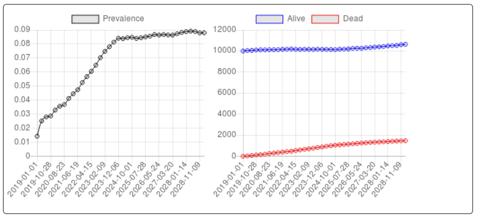

############
Introduction
############

|PROJECT| is a framework for implementing agent-based models of sexually
transmitted infection epidemics.

It is designed to handle up to tens of millions of agents on a mid-range laptop,
or to run many smaller simulations consisting of thousands of agents quickly in
parallel. On a high performance computer it can run dozens of large simulations
or hundreds of small ones in parallel.

The output of the simulations is written to CSV files, which can be further
processed in scripting languages like Python or R.

You can do sophisticated simulations without making any modifications to the
code. But if you do wish to extend the framework, it is written in C. The
framework has been designed with extensibility in mind.

|PROJECT| is developed and tested on GNU/Linux using the gcc compiler (and often
the Clang compiler too). It uses two portable 3rd-party libraries: the GNU
Scientific Library and GLib. The code adheres to the C11 standard and should
compile on any standards-compliant modern C compiler.

|PROJECT| is free software (GPL licensed). If you are a C programmer, you can
clone the `source code on Github <https://github.com/nathangeffen/faststi>`_ and
modify it.

There's a web interface to a toy version of |PROJECT| on `Simhub
<https://www.simhub.online/faststi/>`_ that you can play around with to get a
feel for how it works. Here's a screenshot from Simhub:

.. warning:: |PROJECT| is in active development. It is usable (we think) but
             this documentation is changing almost daily. At this point no
             backwards compatibility is being implemented, and no warnings of
             incompatible changes are being documented. |PROJECT| is not yet at
             an alpha release stage. When it is more stable, we will remove this
             warning.
